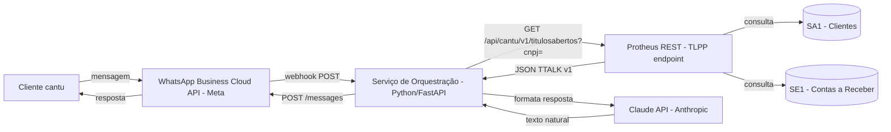

# Consulta de Títulos em Aberto via WhatsApp — Design

**Spec**: `.specs/features/whatsapp-titulos-abertos/spec.md`
**Context**: `.specs/features/whatsapp-titulos-abertos/context.md`
**Status**: Approved

---

## Research Summary

**TOTVS (boas práticas oficiais):**
- Exposição REST no Protheus segue o padrão TTALK (mensagens de erro `v1`, já coberto pela skill `tlpp-rest-endpoint-generator`)
- Boa prática TOTVS: usar um serviço de AppServer REST **dedicado**, separado do AppServer da aplicação, com `SECURITY=1` (autenticação obrigatória nas requisições REST) — [fonte: TDN, "Configurações REST recomendadas"](https://tdn.totvs.com/pages/releaseview.action?pageId=823799096)
- Sem exemplo/precedente de REST no codebase do cantu hoje (busca no repositório não retornou `@Get`/`WSRESTFUL`/`oRest` existente) — este será o primeiro endpoint REST do projeto

**GitHub (ferramentas para o lado externo, fora do AdvPL/TLPP):**
- WhatsApp: **Meta WhatsApp Business Cloud API** é o caminho oficial/suportado. Wrappers prontos: [`whatsapp-python`](https://pypi.org/project/whatsapp-python/) (Python, simples) ou o [SDK Node.js oficial da Meta](https://whatsapp.github.io/WhatsApp-Nodejs-SDK/). Existe também [`EvolutionAPI/evolution-api`](https://github.com/EvolutionAPI/evolution-api), popular no Brasil, mas parte dela usa Baileys (protocolo não-oficial do WhatsApp Web) — **não recomendo** para este caso por rodar por fora dos termos de uso do WhatsApp, risco de banimento do número, inadequado para uma demonstração a cliente com dado financeiro real.
- Não encontrei nenhum repositório pronto unindo Protheus + WhatsApp + LLM — a integração precisa ser escrita como "cola" entre as três pontas (serviço de orquestração abaixo).

---

## Architecture Overview

Três componentes: WhatsApp (canal), serviço de orquestração (fora do Protheus, Python), e endpoint REST no Protheus (TLPP).



**Padrão escolhido no Protheus:** REST via anotações (`@Get`) — skill `tlpp-rest-endpoint-generator`.

---

## Tables and Dictionary

| Alias | Physical table | Fields used | Observação |
|---|---|---|---|
| SA1 | SA1010 | A1_FILIAL, A1_COD, A1_LOJA, A1_NOME, A1_CGC | Identificação é feita **somente por `A1_CGC`** (CPF/CNPJ) — busca por `A1_DDD`/`A1_TEL` foi removida do desenho final (decisão revisada 2026-07-13, ver context.md). **SA1 é tabela compartilhada entre filiais neste ambiente** (confirmado pelo usuário) — não filtra por `A1_FILIAL` na busca. `A1_PESSOA` não é mais usado (a mensagem que pede o documento agora é genérica, "CPF ou CNPJ", sem tentar adivinhar o tipo de pessoa antes de identificar o cliente). **Só consultada na empresa corrente do AppServer REST** (não multi-empresa) — o código/loja do cliente encontrado vale nas demais empresas (confirmado pelo usuário) |
| SE1 | SE1`<empresa>`0 (uma tabela física por empresa) | E1_CLIENTE, E1_LOJA, E1_PREFIXO, E1_NUM, E1_PARCELA, E1_TIPO, E1_VENCTO, E1_VALOR, E1_SALDO | **Decisão final 2026-07-13:** consulta cruza **todas as empresas** do ambiente (não só a empresa corrente), via `UNION ALL` sobre `SE1<empresa>0` para cada empresa retornada por `FWLoadSM0()`. **Sem filtro de `E1_FILIAL`** — removido a pedido do usuário, já que o mesmo cliente pode ter títulos em filiais/empresas diferentes. Uso de `E1_SALDO` confirmado em uso real (`unise1_vinho.prw`, `AFIN003.prw`) |

---

## Code Reuse Analysis

Não há endpoint REST nem rotina de consulta de títulos por telefone reaproveitável no cantu hoje — este é o primeiro componente REST do projeto. Reaproveita apenas os padrões genéricos (query segura com `FWExecStatement`, filtros obrigatórios `D_E_L_E_T_`/filial) já exigidos pelas convenções do projeto.

---

## Components

### 1. Endpoint REST — Consulta de Títulos por CPF/CNPJ (Protheus/TLPP)

**Type:** REST Endpoint (`@Get`, anotação TLPP)
**Location:** `Fontes_Doc/Master/Fontes/SIGAFIN/ConsTitWA.tlpp` — nome descritivo (não é Entry Point, então não segue numeração de rotina oficial; convenção real observada no SIGAFIN do cantu para fontes customizados não-EP é nome descritivo, não `FINA###`). Respeita o limite de 10 caracteres para identificadores internos
**Purpose:** dado um CPF/CNPJ, identifica o cliente no SA1 (por `A1_CGC`, sem busca por telefone) e retorna os títulos em aberto do SE1 (decisão final 2026-07-13 — ver context.md)
**Interfaces:**
- Input: query param `cnpj` (obrigatório, CPF ou CNPJ, só dígitos)
- Output: JSON padrão TTALK v1, com 2 formatos possíveis:
  1. **Encontrado:** `{"status":"found", "cliente":{...}, "titulos":[...]}`
  2. **Não encontrado** (nenhum cliente com esse `A1_CGC`): `{"status":"not_found"}`
**Dependencies:** AppServer REST com `SECURITY=1`, usuário de integração dedicado (a ser criado pelo usuário no Configurador) para autenticação
**Reuses:** padrão da skill `tlpp-rest-endpoint-generator`

### 2. Serviço de Orquestração (externo, fora do AdvPL/TLPP)

**Type:** Serviço Python (FastAPI) — webhook receiver + orquestrador
**Location:** fora do repositório AdvPL/TLPP — projeto novo separado
**Purpose:** recebe mensagem do WhatsApp, chama o endpoint REST do Protheus, usa o Claude API para formatar a resposta em linguagem natural, e envia de volta pelo WhatsApp
**Interfaces:**
- Input: webhook do WhatsApp Business Cloud API (POST)
- Output: chamada à API de envio de mensagens do WhatsApp
**Dependencies:** credenciais do WhatsApp Business Cloud API (Meta), chave da API Anthropic, credencial do usuário de integração REST do Protheus
**Reuses:** wrapper `whatsapp-python` ou SDK oficial Node.js da Meta (a definir linguagem)

---

## Data Models / Queries

### Identificar cliente por CPF/CNPJ

Identificação é feita diretamente por `A1_CGC` — não há mais parsing/uso de telefone em nenhuma etapa.

```sql
SELECT A1_FILIAL, A1_COD, A1_LOJA, A1_NOME
FROM SA1010 SA1
WHERE SA1.D_E_L_E_T_ = ' '
  AND SA1.A1_CGC = ?   -- CPF/CNPJ só dígitos
```

**Sem filtro de `A1_FILIAL`** — SA1 é tabela compartilhada entre filiais neste ambiente (confirmado pelo usuário), filtrar seria redundante. **Sem `%nolock%`** — ver nota de bug real abaixo.

### Títulos em aberto do cliente — todas as empresas (decisão final 2026-07-13)

O ambiente tem múltiplas empresas, cada uma com sua própria tabela física de SE1 (convenção `SE1<empresa>0`, confirmada ativa em outros fontes reais do cantu — `WFNPEPLM.prw`, `MT100TOK.PRW`, `nfesefaz.prw`, para outras tabelas). O mesmo código/loja de cliente vale em todas as empresas (confirmado pelo usuário), então a busca varre todas.

**Por que não usar `RpcSetEnv` por empresa** (o único padrão já usado no cantu para iterar empresas, ex. `CCUpdFY.prw`): a regra SonarQube **BG1000** proíbe `RpcSetEnv`/`RpcSetType` dentro de endpoint REST — risco real de vazar contexto de empresa entre requisições concorrentes numa mesma thread do AppServer (um cliente veria dado de outra empresa). Por isso a abordagem escolhida monta o nome físico da tabela via SQL, sem trocar o ambiente:

```tlpp
aEmpresas := FWLoadSM0()   // lista empresas/filiais sem tocar em SM0 direto (CA2000)
// aEmpresas[nI][1] = codigo da empresa (posicao confirmada via TDN/devforum + correlacao
// com SM0_CODFIL==2 no codebase - a constante simbolica SM0_CODIGO NAO existe no include
// chain do .tlpp, so funciona em .prw com Protheus.ch; usar indice [1] diretamente)
```

```sql
SELECT E1_PREFIXO, E1_NUM, E1_PARCELA, E1_TIPO, E1_VENCTO, E1_VALOR, E1_SALDO
FROM SE1010 SE1   -- "SE1" + codigo_empresa ("01") + "0", uma vez por empresa
WHERE SE1.D_E_L_E_T_ = ' '
  AND SE1.E1_CLIENTE = ?
  AND SE1.E1_LOJA = ?
  AND SE1.E1_SALDO > 0
UNION ALL
-- repete para cada empresa retornada por FWLoadSM0(), cada bloco com seus proprios "?"
```

**Sem `%nolock%`** — ver nota de bug real abaixo. **Sem `E1_FILIAL`** — removido a pedido do usuário (títulos podem estar em qualquer filial/empresa).

**Risco aceito e não 100% eliminado:** se alguma empresa do `SM0` não tiver a tabela física `SE1<empresa>0` nesse formato exato, a query inteira falha (erro Oracle de tabela inexistente) em vez de só pular aquela empresa — testado com sucesso no ambiente real (`06586594995`, título retornado corretamente), mas não há tratamento por-empresa de "tabela não existe".

---

## Bugs reais encontrados na compilação (2026-07-13)

`advpls appre` (validação local) passou limpo em todas as rodadas abaixo — nenhum destes foi pego por ele, só pelo compile real contra o AppServer (`CO9W3L_PROD_COMP`, ambiente Oracle):

1. **`TCQuery ... New Alias` inventado** — comando não existe; corrigido para o padrão da skill `tlpp-rest-endpoint-generator` (`cQuery := oStatement:GetFixQuery()` + `DBUseArea(.T., "TOPCONN", TCGenQry(,, cQuery), cAlias, .F., .T.)`)
2. **`cFilial` como nome de parâmetro** — colide com a variável de sistema reservada (regra já documentada no CLAUDE.md, não verificada antes de gerar o código). Renomeado para `cFilAux`
3. **`%nolock%`/`%NOLOCK%` causando `ORA-00911: invalid character`** — o `ChangeQuery()` não limpa esse hint corretamente neste ambiente Oracle (deixa `%%` sobrando na query final, independente de maiúsculo/minúsculo — testado os dois). Removido por completo dos dois SELECTs; não é obrigatório para a corretude, só uma otimização de lock. **Não investigado a fundo o motivo exato** — se quiser reaproveitar `%nolock%` em queries futuras neste ambiente, vale abrir chamado TOTVS ou testar isoladamente antes

**Rodada 2 — redesenho multi-empresa (2026-07-13):**

4. **`SM0_CODIGO` — variável/constante não existe** (`variable does not exist SM0_CODIGO`) — os únicos usos reais dessa família de constantes encontrados no cantu (`SM0_CODFIL`, `SM0_GRPEMP`, `SM0_CGC`) são em `.prw` com `#Include "Protheus.ch"`; no `.tlpp` (cadeia de include via `tlpp-core.th`/`totvs.ch`) a constante não está definida. Corrigido usando o índice posicional `aEmpresas[nI][1]` diretamente (confirmado via TDN/devforum: `FWLoadSM0()` retorna `[codEmpresa, codFilial, ...]`, e via correlação no código real que `SM0_CODFIL == 2`)
5. **`DToC()` com erro `argument #0 error, expected D->C`** em `E1_VENCTO` — campo `DATE` do Oracle não veio tipado como `D` nativo numa query genérica com `UNION ALL` via `TCGenQry`/`DBUseArea` (gotcha conhecido desse tipo de consulta). Corrigido com função defensiva `DtVencWA()` que checa `ValType()` e trata tanto `D` nativo quanto `C` no formato `YYYYMMDD` (via `STOD()`)
6. **`FwAliasInDic()`/`RetSqlName()` não têm variante multi-empresa** — confirmado por busca no código (nenhuma chamada com mais de 1 argumento em nenhum dos dois projetos). Descartada a ideia de resolver nome físico de tabela de outra empresa sem montar a string manualmente

**Validado end-to-end (2026-07-13) com CPF real de teste (`06586594995`):** `status: "found"`, cliente `EDISON GRESKI BARBIERI` (`065865949`/`0001`), 1 título retornado (`EDI000001`, vencimento `13/09/2026`, saldo `10,00`) — busca cruzando todas as empresas do ambiente confirmada funcionando.

## Open Questions

- [x] **Identificação do cliente** — resolvido (revisado 2026-07-13): identificação direta por CPF/CNPJ (`A1_CGC`), sem busca/filtro por telefone em nenhuma etapa — decisão final do usuário por ser mais simples e mais seguro
- [x] **Memória de identidade durante a conversa** — resolvido: serviço de orquestração guarda o CPF/CNPJ confirmado por telefone (chave da sessão) por 15 minutos em memória de processo, evitando repetir a pergunta a cada mensagem
- [x] **Hospedagem do serviço Python de orquestração** — resolvido: roda na máquina do usuário durante o desenvolvimento. Requer um túnel HTTPS público (ngrok ou similar) apontando pro `localhost`, já que o webhook do WhatsApp Cloud API precisa entregar mensagens numa URL pública — sem isso a Meta não consegue notificar o serviço local
- [x] **Usuário de integração REST no AppServer** — resolvido: usuário dedicado novo será criado pelo usuário no Configurador (SIGACFG) e as credenciais serão repassadas antes do Execute
- [x] **Nome definitivo do fonte TLPP** — resolvido: `ConsTitWA.tlpp` (não é Entry Point, segue nome descritivo — convenção real do SIGAFIN para fontes customizados não-EP — respeitando o limite de 10 caracteres para identificadores)
